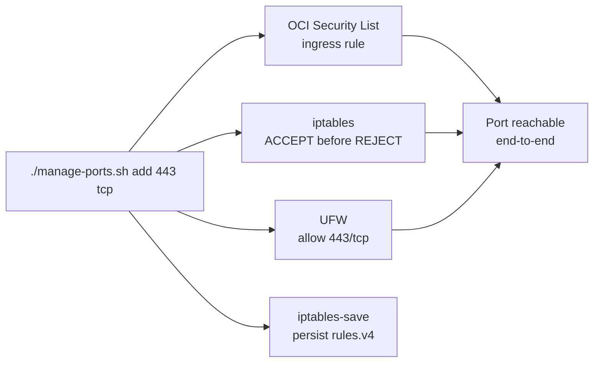

# OCI Compute Instance — Terraform


Minimal Terraform configuration to provision an Oracle Cloud Infrastructure (OCI) compute instance on the ARM-based **A1 Flex** shape, sized to stay inside the OCI Always Free tier (1 OCPU / 6 GB RAM by default, scalable to 4 OCPU / 24 GB). Ships with two shell helpers that solve the two recurring pain points of running A1: chronic "Out of host capacity" errors, and the three-layer firewall (OCI Security List + Oracle Linux `iptables` + UFW) you must touch in lock-step to open a port.

Designed for a single-tenant hobby / dev server — one instance, one VNIC, one public IP.

---

## ✨ Features

- **One-resource Terraform** — a single `oci_core_instance` declares the VM, VNIC, public IP, and SSH key. No VPC/subnet boilerplate; you point it at an existing compartment and subnet.
- **Always-Free-shaped by default** — `VM.Standard.A1.Flex` at 1 OCPU / 6 GB RAM, linearly scalable up to the 4 OCPU / 24 GB Always Free ceiling without re-provisioning.
- **Retry-until-capacity provisioning** — `retry-terraform.sh` loops `terraform apply` with randomized jitter (60–75 s) until the instance lands, then fires a native desktop notification on macOS or Linux.
- **Three-firewall port manager** — `manage-ports.sh` opens or closes a port across the OCI Security List, Oracle Linux `iptables` (which ships a `REJECT` ahead of UFW), and UFW in a single command, so a port is actually reachable end-to-end.
- **Sensible OCID defaults** — compartment, image, and subnet are pre-filled for the author's Mumbai (`ap-mumbai-1`) tenancy; override anything via `terraform.tfvars`.
- **Clean repository hygiene** — state files, `.tfvars`, and private keys are gitignored; no secrets are committed.

---

## 📦 Installation

### Prerequisites

- **Terraform** ≥ 1.0 ([install](https://developer.hashicorp.com/terraform/downloads))
- **OCI credentials**, configured in one of two ways:
  - an OCI CLI config file at `~/.oci/config` (created by `oci setup config`), **or**
  - environment variables: `TENANCY_OCID`, `USER_OCID`, `FINGERPRINT`, `PRIVATE_KEY_PATH`, `REGION`
- **An SSH keypair** — the public key (default `~/.ssh/id_ed25519.pub`) is injected into the instance at boot.
- **An existing OCI compartment + subnet** to deploy into. Their OCIDs go in `terraform.tfvars`.

For the optional helper scripts you will additionally need:

- **OCI CLI** ([install](https://docs.oracle.com/en-us/iaas/Content/API/SDKDocs/cliinstall.htm)) — used by `manage-ports.sh` to edit the Security List.
- **`python3`** on your local machine — `manage-ports.sh` shells out to it for JSON munging.
- **An SSH config alias `oci`** pointing at the running instance, e.g. in `~/.ssh/config`:

  ```ssh-config
  Host oci
      HostName <instance-public-ip>
      User opc
      IdentityFile ~/.ssh/id_ed25519
  ```

### Get the code

```bash
git clone <your-repo-url> oci-terraform-instance
cd oci-terraform-instance
```

---

## 🚀 Usage

### 1. Provision the instance

Copy the example variables and fill in your OCIDs:

```bash
cp terraform.tfvars.example terraform.tfvars
```

Edit `terraform.tfvars`:

```hcl
compartment_id      = "ocid1.tenancy.oc1..your-tenancy-ocid"
image_id            = "ocid1.image.oc1.ap-mumbai-1.your-image-ocid"
subnet_id           = "ocid1.subnet.oc1.ap-mumbai-1.your-subnet-ocid"
ssh_public_key_path = "~/.ssh/id_ed25519.pub"
```

Initialize, plan, and apply:

```bash
terraform init
terraform plan
terraform apply
```

Terraform prints the new instance's OCID and public IP:

```text
Outputs:

instance_id = "ocid1.instance.oc1.ap-mumbai-1.ab..."
public_ip   = "129.153.xxx.xxx"
```

Connect:

```bash
ssh opc@$(terraform output -raw public_ip)
```

### 2. Survive "Out of host capacity"

A1 capacity is shared and frequently exhausted. Instead of applying by hand, run the retry loop — it re-issues `terraform apply -auto-approve` every 60–75 s (randomized jitter) until it succeeds, logs each attempt to `terraform-retry.log`, and pings a desktop notification when the instance is up:

```bash
./retry-terraform.sh                  # retry forever
MAX_ATTEMPTS=100 ./retry-terraform.sh # cap at 100 attempts
```

### 3. Open and close ports

A port on this instance is reachable only when **all three** firewalls agree. `manage-ports.sh` does that atomically:

```bash
# List what's open across all three layers
./manage-ports.sh list

# Open TCP 443 for HTTPS
./manage-ports.sh add 443 tcp 'HTTPS'

# Open UDP 19132 for Minecraft Bedrock
./manage-ports.sh add 19132 udp 'Minecraft Bedrock'

# Close it again
./manage-ports.sh remove 19132 udp
```

Before first use, set `SECURITY_LIST_ID` inside `manage-ports.sh` to your own VCN's security list OCID.

---

## ⚙️ Configuration

### Terraform variables

| Variable | Description | Default |
|----------|-------------|---------|
| `compartment_id` | OCI Compartment OCID to deploy into | author's tenancy OCID |
| `image_id` | OCI Image OCID for the boot volume | Oracle Linux image, `ap-mumbai-1` |
| `subnet_id` | OCI Subnet OCID for the primary VNIC | a subnet in `ap-mumbai-1` |
| `ssh_public_key_path` | Path to the SSH public key injected at boot | `~/.ssh/id_ed25519.pub` |

The instance shape and sizing are fixed in `main.tf` and can be edited there:

| `shape_config` | Value |
|----------------|-------|
| `shape` | `VM.Standard.A1.Flex` (ARM64) |
| `ocpus` | `1` (scale to `4` for the Always Free max) |
| `memory_in_gbs` | `6` (scale to `24` for the Always Free max) |

To resize an already-running instance in place (no re-provision), use the OCI CLI:

```bash
oci compute instance update \
  --instance-id <instance-ocid> \
  --shape VM.Standard.A1.Flex \
  --shape-config '{"ocpus": 4, "memory-in-gbs": 24}' \
  --force
```

### `retry-terraform.sh` environment

| Variable | Description | Default |
|----------|-------------|---------|
| `MAX_ATTEMPTS` | Maximum apply attempts before giving up (0 = unlimited) | `0` |

Logs are appended to `./terraform-retry.log`.

### `manage-ports.sh` configuration

| Item | Where | Description |
|------|-------|-------------|
| `SECURITY_LIST_ID` | top of `manage-ports.sh` | OCID of the VCN security list to edit |
| SSH alias `oci` | `~/.ssh/config` | host used to reach the instance for `iptables`/`ufw` edits |

---

## 🧱 How it works

The repository is two thin layers over stock OCI: a one-resource Terraform manifest, and two shell scripts that paper over OCI's quirks.

```
main.tf                 # provider config + the single oci_core_instance resource + outputs
variables.tf            # four input variables, each with a Mumbai-tenancy default
terraform.tfvars.example# template copied to (gitignored) terraform.tfvars
retry-terraform.sh      # capacity-retry loop with jitter + desktop notification
manage-ports.sh         # atomic port changes across OCI Security List / iptables / UFW
```

### Why a three-layer port manager?

Oracle Linux ships an `iptables` `REJECT` rule that fires *before* UFW, so opening a port only in the OCI Security List **and** UFW still leaves it blocked. `manage-ports.sh` inserts the `iptables` `ACCEPT` at the right position so traffic flows, then mirrors the rule into the cloud Security List and UFW so the layers never drift:



### How the retry loop works

`retry-terraform.sh` treats success as **exit code 0 with no "Out of host capacity" string** in the output, sleeps `60 + rand(0..15)` seconds between attempts to desynchronize from other free-tier hunters, and stops the moment a real instance appears.

---

## 🤝 Contributing

This is a small personal config. If you spot a bug or have a sharpening, open an issue or pull request — keep changes scoped to the single-resource design.

---

## 📄 License

No `LICENSE` file is present in this repository, so the code is **all rights reserved** by default. Add a `LICENSE` file (e.g. MIT) before sharing or forking if you intend to permit reuse.
